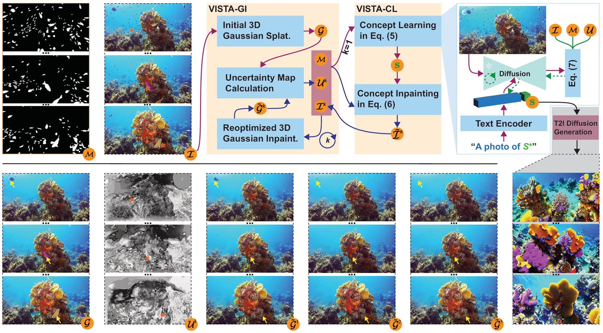

## Visibility-Uncertainty-guided 3D Gaussian Inpainting via Scene Conceptional Learning

### Introduction

The **VISTA** (VISibility-uncerTainty-guided 3D Gaussian Inpainting via Scene conceptuAl learning) GitHub repository presents an advanced approach to **3D Gaussian Inpainting (3DGI)**, integrating **visibility uncertainty analysis** and **scene conceptual learnin**g to achieve seamless object removal and reconstruction in 3D scenes.

### Key Features

- **Visibility-Uncertainty Measurement**: Estimates the visibility confidence of 3D points across multiple input views to optimize inpainting.

- **Scene Conceptual Learning**: Uses a diffusion model to synthesize missing content based on a learned concept of the scene without the masked object.

- **Handling Dynamic and Static Objects**: Effectively removes both static obstructions and dynamic distractors, such as rapidly moving objects.

- **High-Quality 3D Reconstruction**: Utilizes 3D Gaussian Splatting (3DGS) to generate artifact-free novel views, improving upon traditional inpainting methods.

### Visualization of our results

We demonstrate some results of our methods from our underwater 3D Inpainting Dataset. The visualization of the source images (left) and the sythetic views (right) is as follows:

#### Multi-objects 3D Inpainting

#### Single-object 3D Inpainting

### Conclusion

This repository includes visualization and dataset (coming soon) for reproducibility and further research. Contributions from the community are welcome to improve and expand the capabilities of VISTA! 🚀